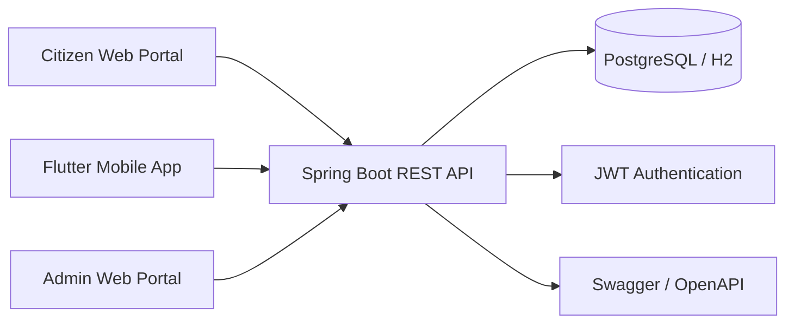

# Traffic Fine Management System

> A multi-platform traffic fine management solution for Sri Lanka Police, providing a Spring Boot backend, a React/Vite citizen portal, and a Flutter mobile app.

## ✨ Features

- 🛡️ Secure backend with Spring Security and JWT support
- 🔎 Fine search, lookup, and management workflows
- 📱 Cross-platform access via web and mobile applications
- 📊 Admin-focused analytics, reports, and operational dashboards
- 🗃️ Database support with PostgreSQL and H2
- 📘 API documentation with OpenAPI / Swagger UI
- ⚡ Modern citizen portal built with React and Vite
- 🧩 Flutter mobile app for a native cross-platform experience

## Table of Contents

- [✨ Features](#-features)
- [📦 Installation](#-installation)
- [⚡ Quick Start](#-quick-start)
- [🧪 Usage / Examples](#-usage--examples)
- [🗂️ Project Structure](#-project-structure)
- [⚙️ Configuration](#-configuration)
- [🤝 Contributing](#-contributing)
- [📬 Contact / Acknowledgments](#-contact--acknowledgments)

## 📦 Installation

### Prerequisites

- Java 17 or newer
- Maven 3.9+
- Node.js 18+ and npm
- Flutter SDK 3.9+
- Git

### Clone the repository

```bash
git clone https://github.com/keshankumara/traffic-fine-management-system.git
cd traffic-fine-management-system
```

### Backend API

```bash
cd traffic-fine-api
mvn clean package
```

### Citizen Web Portal

```bash
cd citizen-web-portal/citizen
npm install
npm run build
```

### Mobile App

```bash
cd mobile-app/traffic_fine_app
flutter pub get
flutter build apk
```

## ⚡ Quick Start

### 1. Start the backend

```bash
cd traffic-fine-api
mvn spring-boot:run
```

### 2. Start the citizen portal

```bash
cd citizen-web-portal/citizen
npm run dev
```

### 3. Run the mobile app

```bash
cd mobile-app/traffic_fine_app
flutter run
```

### 4. Open Swagger UI

If Swagger is enabled in your local environment, open:

```text
http://localhost:8080/swagger-ui/index.html
```

## 🧪 Usage / Examples

### Build commands

```bash
# Backend
cd traffic-fine-api
mvn clean package

# Citizen portal
cd ../citizen-web-portal/citizen
npm run lint
npm run preview

# Mobile app
cd ../../mobile-app/traffic_fine_app
flutter test
flutter build web
```

### Example workflow

- Citizens can search for traffic fines and view fine details.
- Users can access services through the web portal or mobile app.
- Administrators can manage users, review payments, and monitor system activity.

### Architecture overview



## 🗂️ Project Structure

```text
traffic-fine-management-system/
├── traffic-fine-api/              # Spring Boot REST API
├── citizen-web-portal/
│   └── citizen/                   # React + Vite citizen portal
├── mobile-app/
│   └── traffic_fine_app/          # Flutter mobile application
├── admin-web-portal/              # Admin portal workspace
├── database/                      # Database-related files and notes
├── docs/                          # Project documentation
├── src/                           # Shared or root-level frontend assets
└── LICENSE
```

### Main components

- `traffic-fine-api/` contains the backend services, REST endpoints, security, and persistence layer.
- `citizen-web-portal/citizen/` contains the React/Vite frontend for citizen-facing workflows.
- `mobile-app/traffic_fine_app/` contains the Flutter application for mobile users.
- `admin-web-portal/` is reserved for the admin-side web experience.
- `docs/` is the right place for setup guides, design notes, and deeper technical documentation.

## ⚙️ Configuration

### Backend

The backend uses Spring Boot 3.3.0 and Java 17. Common configuration is typically managed in:

- `traffic-fine-api/src/main/resources/application.properties`
- profile-specific property files, if present

Typical settings to review:

- server port
- database connection URL
- database username and password
- active Spring profile
- JWT secret and token settings
- logging configuration

Example environment-style configuration:

```bash
SPRING_PROFILES_ACTIVE=dev
DB_URL=jdbc:postgresql://localhost:5432/traffic_fine_db
DB_USERNAME=postgres
DB_PASSWORD=change-me
JWT_SECRET=change-this-secret
```

### Citizen Portal

The citizen portal is a Vite application. Configure the API base URL in your frontend environment or service layer.

Example:

```bash
VITE_API_BASE_URL=http://localhost:8080
```

### Mobile App

The Flutter app should point to the same backend API as the web portal. Update the API base URL in the app configuration or service layer before building for production.

### Database

The backend supports both:

- PostgreSQL for persistent development and production use
- H2 for lightweight local testing

## 🤝 Contributing

Contributions are welcome.

1. Fork the repository
2. Create a feature branch
3. Make your changes
4. Run the relevant build and test commands
5. Open a pull request

Before submitting, verify that the affected module builds successfully:

```bash
# Backend
cd traffic-fine-api
mvn clean package

# Citizen portal
cd ../citizen-web-portal/citizen
npm run build

# Mobile app
cd ../../mobile-app/traffic_fine_app
flutter test
```

## 📬 Contact / Acknowledgments

For questions, feedback, or contributions, open an issue or pull request in this repository.

Acknowledgments to the teams and technologies that make this project possible:

- Spring Boot
- React
- Vite
- Flutter
- PostgreSQL
- H2
- Spring Security
- OpenAPI / Swagger
